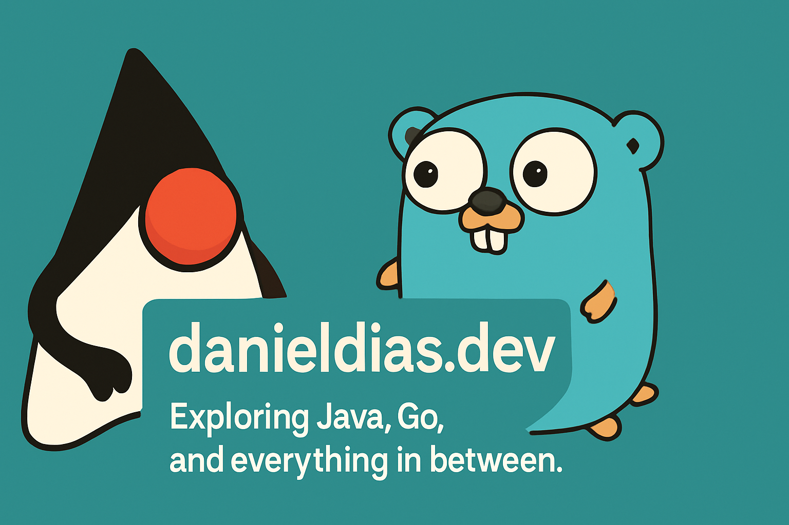

<h1 align="center">Hi there, I'm Daniel Dias 👋</h1>

  
  

---

### 👨‍💻 About Me

Backend Software Engineer with strong experience in designing and evolving distributed systems using Java (Spring Boot, Jakarta EE) and Golang. At Itaú Unibanco, I work on large-scale modernization, transforming legacy monoliths into scalable, maintainable microservices using DDD, Clean Architecture, and SOLID principles.

I combine hands-on development with architectural guidance — covering API design, asynchronous messaging (Kafka, Camel), observability (Datadog), CI/CD pipelines, AWS infrastructure, and performance tuning.

As a committer to  [Apache TomEE](https://tomee.apache.org/) and contributor to Jakarta EE and MicroProfile, I help improve enterprise Java runtimes and developer experience through open source contributions and community engagement.

Passionate about clean code, simplicity, and building software that evolves with the business.

Tech Stack: 
 - Java 8–21
 - Spring Boot
 - Jakarta EE
 - Golang
 - Apache TomEE
 - MicroProfile
 - REST APIs
 - JPA/Hibernate
 - Kafka
 - Apache Camel
 - Docker
 - Git
 - Jenkins
 - AWS (EC2, ECS, S3, RDS)
 - Terraform
 - CI/CD
 - Observability (Datadog)
 - Test Automation (JUnit, Mockito, Wiremock)

---

### 🔧 Technologies & Tools

---

### 📚 Blog Posts

I regularly share insights and tutorials on Java and Jakarta EE on my [blog](https://daniel-dos.github.io/danieldias). Check out my latest articles:

- [Criando uma aplicação com JSR-371(MVC 1.0)-PT-BR](https://medium.com/danieldiasjava/criando-uma-aplica%C3%A7%C3%A3o-com-jsr-371-mvc-1-0-13635d0fc41f)
- [Criando uma aplicação REST com SparkJava-PT-BR](https://medium.com/danieldiasjava/criando-uma-aplica%C3%A7%C3%A3o-rest-com-sparkjava-4d68737fd9b2)
- [Conhecendo o Apache James](https://medium.com/danieldiasjava/conhecendo-o-apache-james-6ba97f9f43f6)
- [Criando uma aplicação REST com Eclipse Vert.x](https://medium.com/danieldiasjava/criando-uma-aplicacao-rest-com-eclipse-vertx-37921aaa1d77)

---

### 📌 Featured Projects

Here are some projects I've been working on:

- [Apache TomEE](https://github.com/apache/tomee): Mirror of Apache TomEE
- [TomEE Site Generator](https://github.com/apache/tomee-site-generator): Mirror of Apache TomEE Site Generator
- [Krazo](https://github.com/eclipse-ee4j/krazo): MVC framework for Jakarta EE
- [Jakarta MVC](https://github.com/jakartaee/mvc): Jakarta MVC project
- [Medium Blog Posts](https://github.com/Daniel-Dos/danieldiasjava-medium-english): Repository for my English blog posts on Medium
- [Apache DeltaSpike](https://github.com/apache/deltaspike): Mirror of Apache DeltaSpike

---

### 📈 GitHub Stats

  

---

### 🤝 Let's Connect

I'm always open to collaboration and discussions. Feel free to reach out to me through the platforms below:

- 💼 [LinkedIn](https://www.linkedin.com/in/danieldiasds/)
- 📝 [Blog](https://daniel-dos.github.io/danieldias)

---

*Thank you for visiting my profile!*

